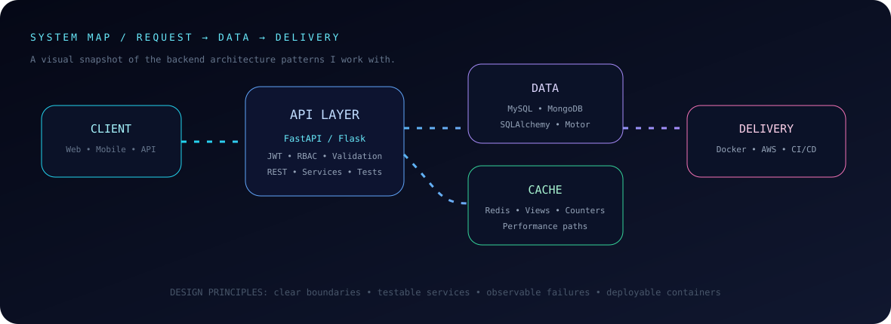
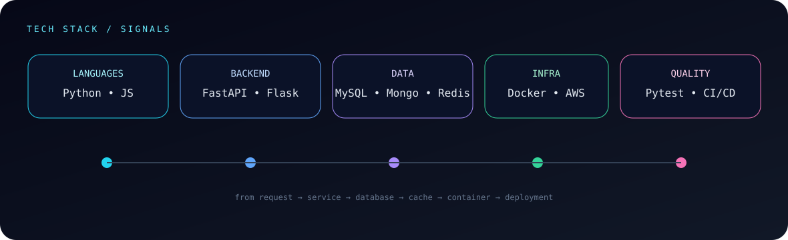
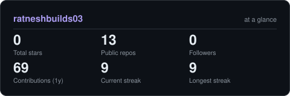

<div align="center">

<!-- Signature visual: keep the original portrait-first terminal composition. -->
<picture>
  <source media="(prefers-color-scheme: dark)" srcset="assets/banner-dark.v9.svg">
  <source media="(prefers-color-scheme: light)" srcset="assets/banner-light.v9.svg">
  
</picture>

<br>

<a href="https://github.com/ratneshbuilds03">
  
</a>

<br><br>

<a href="https://github.com/ratneshbuilds03"></a>
<a href="mailto:ratneshmakwana51@gmail.com"></a>
<a href="https://github.com/ratneshbuilds03/ratneshbuilds03"></a>

<br><br>


</div>

---

## ⚡ Backend, but built like a system

I'm **Ratnesh Makwana**, a backend-focused developer working with **Python, FastAPI and Flask**. I like taking an idea, breaking it into services, wiring the data layer, adding authentication and tests, containerizing it, and getting it ready for deployment.

<table>
<tr>
<td width="50%" valign="top">

### 🧠 What I build

- REST APIs and service-oriented backends
- Authentication, JWT, roles and permissions
- SQL + NoSQL data workflows
- Redis-backed caching and counters
- File/content workflows and cloud storage
- Dockerized applications and CI/CD pipelines
- AI-enabled backend features with Gemini APIs

</td>
<td width="50%" valign="top">

### 🧭 Engineering mindset

```text
Idea
 ↓
API design → validation → services
 ↓
data → cache → background workflows
 ↓
tests → containers → CI/CD
 ↓
reliable software that can ship
```

</td>
</tr>
</table>

---

<div align="center">

## 🛰️ System Architecture



</div>

---

<div align="center">

## 🧰 My Backend Stack


<br><br>



</div>

---

## 📡 Engineering Signals

<table>
<tr>
<td width="50%" align="center" valign="middle">

<picture>
  <source media="(prefers-color-scheme: dark)" srcset="assets/radar-dark.svg">
  <source media="(prefers-color-scheme: light)" srcset="assets/radar-light.svg">
  
</picture>

</td>
<td width="50%" align="center" valign="middle">

<picture>
  <source media="(prefers-color-scheme: dark)" srcset="assets/radar-langs-dark.svg">
  <source media="(prefers-color-scheme: light)" srcset="assets/radar-langs-light.svg">
  
</picture>

</td>
</tr>
</table>

> **Focus areas, not fake percentages:** Python • APIs • databases • caching • containers • cloud • testing

---

# 🚀 Featured Backend Projects

### 01 · 🟦 MiniStream — Content Streaming Backend

A production-style backend project with authentication, creator/viewer roles, content uploads, subscriptions, views, likes, search and notification workflows.

**Stack:** `Python` `FastAPI` `MySQL` `MongoDB` `Redis` `AWS S3` `Docker` `CI/CD`

---

### 02 · 🤖 AI Resume Screener

An AI-assisted backend workflow for processing resume information and making candidate/resume analysis more useful through API-driven processing.

**Focus:** `Python` `REST APIs` `AI Integration` `Backend Processing`

---

### 03 · 🛒 Cartify / Cart System

An e-commerce backend covering products, cart workflows, order placement and database integration across SQL and MongoDB components.

**Stack:** `FastAPI` `Python` `MySQL` `MongoDB` `SQLAlchemy` `Motor` `Docker`

[View repository →](https://github.com/ratneshbuilds03/fastapi-project-cart03)

---

### 04 · 🌐 Flask CMS

A Flask-based content management project demonstrating routing, database-backed workflows, authentication and REST-style backend design.

**Stack:** `Python` `Flask` `REST APIs` `Database`

[View repository →](https://github.com/ratneshbuilds03/flask-project-cart04)

---

### 05 · 📝 Notes API

A focused backend API for CRUD workflows, validation, structured request/response handling and persistent application data.

**Stack:** `Python` `FastAPI` `REST API`

---

### 06 · ✅ Task Manager API

A practical API project for task management, validation, persistence and clean backend endpoint design.

**Stack:** `Python` `FastAPI` `REST API`

---

<div align="center">

<a href="https://github.com/ratneshbuilds03?tab=repositories">

</a>

</div>

---

<div align="center">

## 📊 GitHub Snapshot

<picture>
  <source media="(prefers-color-scheme: dark)" srcset="assets/card-stats-dark.svg">
  <source media="(prefers-color-scheme: light)" srcset="assets/card-stats-light.svg">
  
</picture>

<br>


</div>

---

## 🛠️ What I'm Working On

```text
Backend Engineering  →  FastAPI · Flask · REST APIs
Data                 →  MySQL · MongoDB · Redis
Infrastructure       →  Docker · GitHub Actions · AWS
Quality              →  Pytest · validation · clean architecture
AI                   →  Gemini API · AI-powered backend features
Next                 →  system design · deployment · cloud-ready architecture
```

## 🎯 Current Direction

**Backend Developer → Software Engineer**

I'm strengthening production-style backend development, system design fundamentals, automated testing, deployment and cloud-ready architecture while building real projects instead of only tutorials.

---

<div align="center">

## 🤝 Let's Build Something Useful

<a href="mailto:ratneshmakwana51@gmail.com"></a>
<a href="https://github.com/ratneshbuilds03"></a>

<br><br>

<sub>Designed as a living engineering profile · Animated SVG system map · Built for a backend developer 🚀</sub>

</div>
